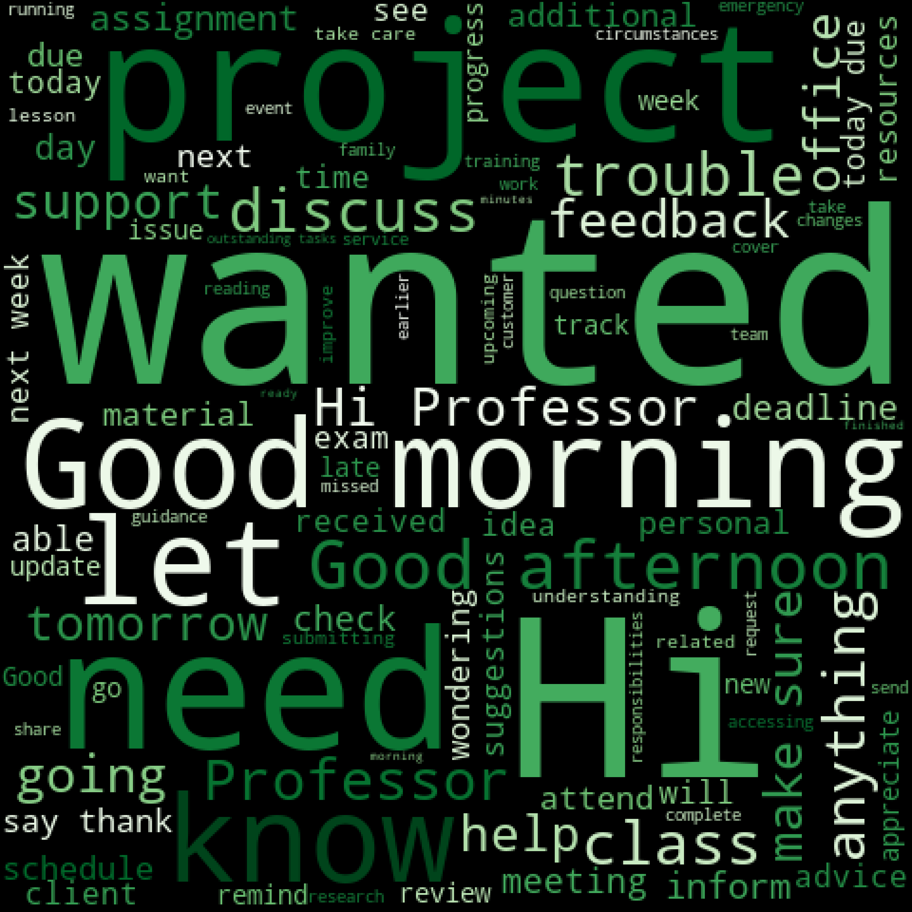
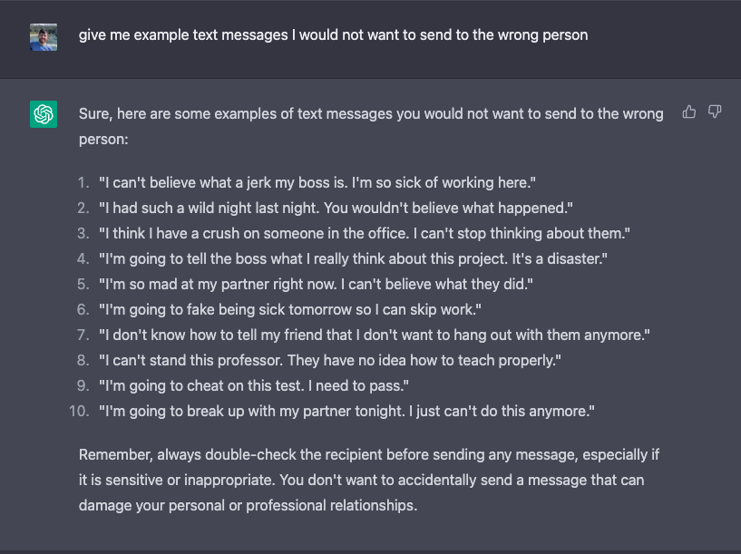

# Text Confirmation Dector

*Are you sure you want to send that message?*

A brief nlp classification tutorial. In this setting, we are creating a model that would decide when to display a confimation message to a user sending a message. Ideally we would like the model to detect messages that contain potentailly harmful or personal messages.

Positive Example: 
>input: 'I hate this job.' 
>
>Model's expected output: 1. 
>
>Decision: DISPLAY confirmation message to user.

Negative Example: 
>input: 'Good luck with the presentation today!' 
>
>Model's expected output: 0. 
>
>Decision: DO NOT DISPLAY confirmation message to user.

Positive Class WordCloud   |  Negative Class WordCloud
:-------------------------:|:-------------------------:
  |  

## Data gathering w/ChatGTP



## Classification Methods

*Naive Bayes*

*Random Forest with TF-IDF and Text Embeddings*

## Limitations & Next Steps
- only small about simulated data
- What about using the sentiment of the message as a feature?
- What you want and don't want to send depends on who you're communicating with. In a real life senario, it could be helpful to include a *reciever* feature (such as coworker, boss, mom, family)


## Getting your environment set up (using venv and pip)
```bash
python3 -m venv env

source env/bin/activate

pip install -r requirements.txt
```